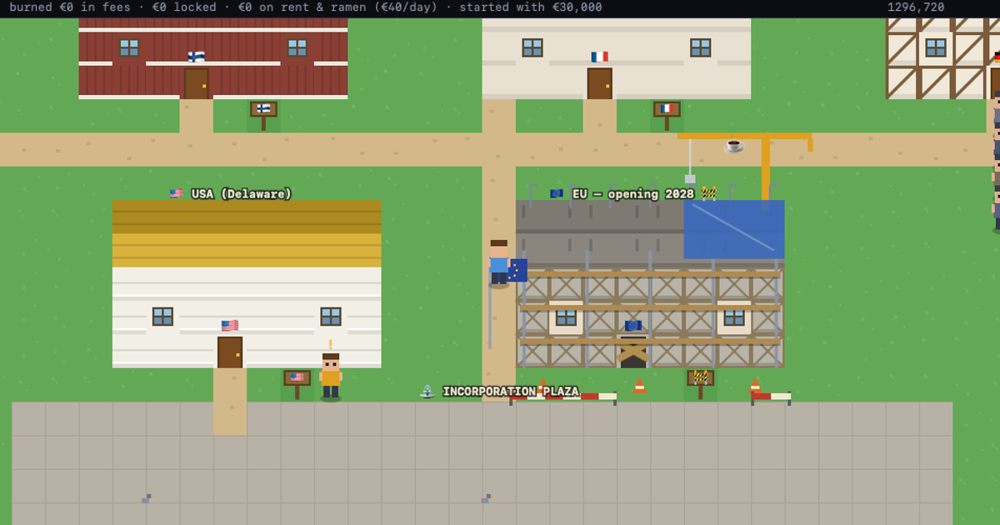
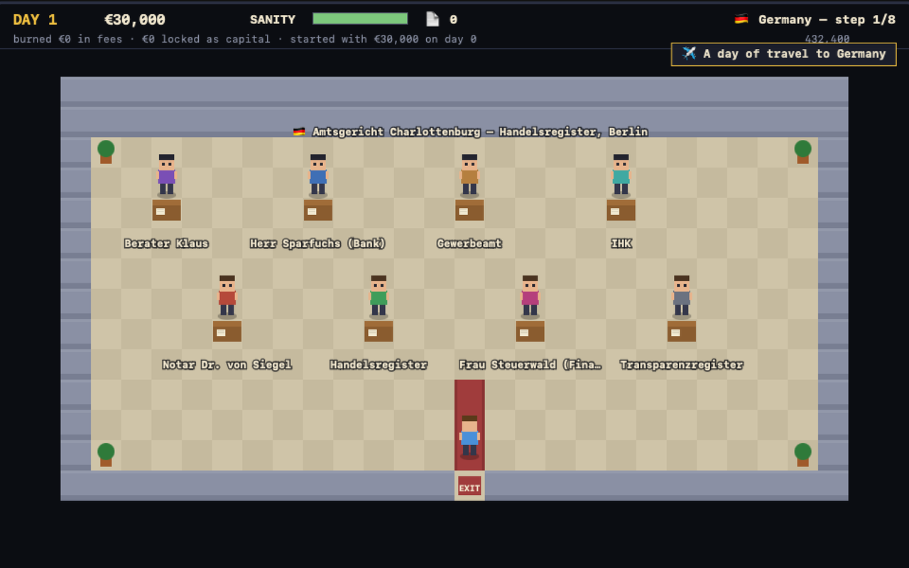

# Incorporation

A bird's-eye, SNES-style adventure through the real company-formation
bureaucracies of the United States and all 27 EU countries.

You are a founder with an idea and €30,000. To exist, you must incorporate —
somewhere. 28 doors ring Incorporation Plaza: Delaware takes a day and ~$400
online; Germany takes a quarter of a year, a notary who reads the deed aloud
(§13 BeurkG — it's the law), a bank↔register circular dependency, and an
online tax portal that mails its activation code on paper.

**Every office, fee, waiting period and absurdity in the game is real**
(rules as of 2025/26, from the official registries and fee schedules).
Press `N` on the certificate screen for the Field Notes.

## Play

Open `index.html` in a browser — no build, no dependencies, one file.
Or play the hosted version at [incorporationgame.eu](https://incorporationgame.eu).

- **Move** — arrows / WASD (hold Shift to sprint) · touch d-pad on mobile
- **Talk / advance** — E / Space / tap
- **Sound** — M
- Dialogue is in each country's language with English subtitles — English
  only where the official channels genuinely offer it.

## What's inside

- Research-verified incorporation chains for US-Delaware + EU-27, including
  the loops: the German bank that sends you back to the notary, the French
  greffe that rejects your statuts over a comma, the Czech landlord consent
  that expires mid-process, the Spanish notario who wants a certified copy
  of your NIE.
- €40/day living costs, sanity, coffee, random bureaucratic events
  (strikes, uncertified photocopies, administrative surcharges).
- Day/night sleeping-bag waits, a beard that grows with the days, seasons
  that turn while you queue.
- Achievements, per-country personal bests, a league table of bureaucracy,
  and an EU construction site ("opening 2028") that cannot be entered.

## Credits

Made with ♥ and AI by [@fbandov](https://x.com/fbandov).

## License

MIT — see [LICENSE](LICENSE).
